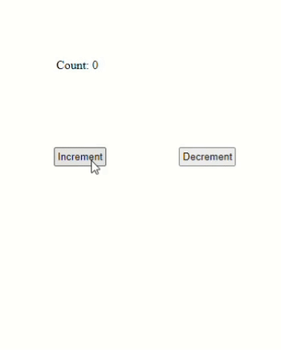

# UPKARAN.js
<div align="center">
    
    <p> - A simple js frontend framework for <i>abhiyanta</i>(engineers)</p>
    <hr>
</div>

Write your frontend like objects

 ## Why a new framework 
 - becz i want to mke it
Want to know the making of this framework [article_link](https://rudransh61.hashnode.dev/thoughts-how-i-created-a-js-framework-in-just-4-days)
# How to use it? 
The main code is in `App.js` file
You can create HTML elements like js objects ...
Example Code :
```javascript
// app.js
import { createState } from "./state.js";
import {ListComponent} from "./Component/ListComponent.js";

// Create reactive state
const initialState = {
    count: 0,
};
const state = createState(initialState);

// Define components
const Increment = () => {
    state.setState({ count: state.getState().count + 1 });
    console.log(state.getState().count);
};

const Decrement = () => {
    state.setState({ count: state.getState().count - 1 });
    console.log(state.getState().count);
};

export function App() {
    return {
        type: "div",
        content: [
            {
                type: "p",
                id: "text",
                content: `Count: ${state.getState().count}`
            },
            {
                type: "button",
                content: "Increment",
                onclick: Increment
            },
            {
                type: "button",
                content: "Decrement",
                onclick: Decrement
            },
            ListComponent(state.getState().count)
        ],
    };
}

// Component/ListComponent.js
// ListComponent.js
import { renderListItem  } from "./RenderCount.js";
// Define a component for rendering a list
export function ListComponent(num) {
    // Function to render the list items
    const renderListItems = () => {
        const comp = [];
        for(let i=0;i<num;i++){
            comp.push(renderListItem());
        }
        return comp;
    };

    return {
        type: 'ul',
        content: renderListItems() // Render the list items dynamically
    };
}

// RenderCount.js

// Define a component to render the count dynamically
export function renderListItem() {
    return {
        type: 'li',
        content: 'HELO' // Function to dynamically render the count
    };
}

```

Output is in `index.html` file of `public` folder...

