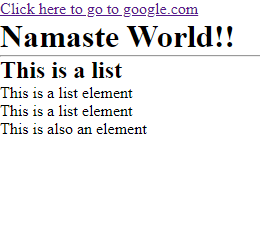

# UPKARAN.js
 - A simple js frontend framework for <i>abhiyanta</i>(engineers)

Write your frontend like objects

 ## Why a new framework 
 - becz i want to create

# How to use it? 
The main code is in `App.js` file
You can create HTML elements like js objects ...
Example Code :
```javascript
import { createState } from './Upkaran.js';

// Define components
export function App() {
    // Create reactive state for storing blog posts
    const postState = createState({
        posts: [
            { id: 1, title: 'First Post', content: 'This is the content of the first post.' },
            { id: 2, title: 'Second Post', content: 'This is the content of the second post.' },
            { id: 3, title: 'Third Post', content: 'This is the content of the third post.' }
        ]
    });

    // Function to render individual post items
    const renderPost = (post) => ({
        type: 'div',
        content: [
            { type: 'h2', content: post.title },
            { type: 'p', content: post.content }
        ]
    });

    // Header component
    const Header = () => ({
        type: 'header',
        content: 'Blog Header'
    });

    // PostList component
    const PostList = () => ({
        type: 'div',
        content: postState.getState().posts.map(post => renderPost(post))
    });

    // Sidebar component
    const Sidebar = () => ({
        type: 'aside',
        content: 'Sidebar'
    });

    // Footer component
    const Footer = () => ({
        type: 'footer',
        content: 'Blog Footer'
    });

    // Render the entire blog app
    return {
        type: 'div',
        content: [
            Header(),
            {
                type: 'div',
                content: [
                    PostList(),
                    Sidebar()
                ]
            },
            Footer()
        ]
    };
}
```

Output is in `index.html` file of `public` folder...
